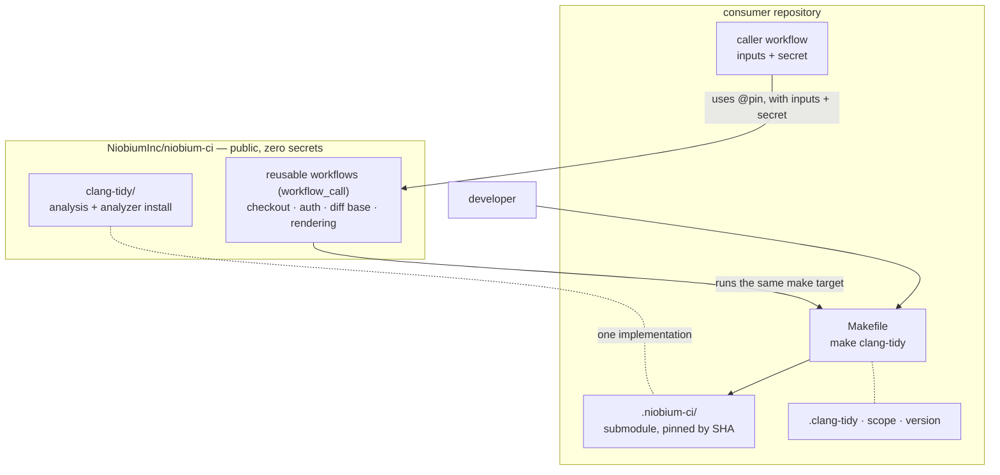

# niobium-ci

Shared CI for Niobium repositories, so consumers stop duplicating CI logic.

## How it works

Two kinds of thing live here, consumed two different ways.

**Reusable workflows** are referenced remotely with `uses:` at a pinned ref. They own
what a local run has no equivalent for: checkout and authentication, a pull request's
diff base, skipping an expensive build when nothing relevant changed, and rendering
results into GitHub. They are the only place a consumer's secret is touched, and they
reference nothing in this repository by tag — so a consumer pinning by SHA gets a pin
that cannot move.

**The analysis scripts** are checked out by the consumer as a **submodule**, pinned by
commit SHA. A local `make clang-tidy` and the gate execute the same file at the same
pinned commit, so they cannot reach different verdicts.

Configuration is not shared. `.clang-tidy`, the scope of product code, and the analyzer
version belong to each repository. What is shared is the runner, not the policy.



A gate run flows from the caller through the reusable workflow, which prepares the
workspace and then delegates the analysis to the consumer's own target:

```mermaid
sequenceDiagram
  participant Dev as pull request
  participant Caller as caller workflow<br/>(consumer)
  participant RW as reusable workflow<br/>(niobium-ci @pin)
  participant Repo as consumer workspace
  Dev->>Caller: trigger
  Caller->>RW: uses @pin (inputs + secrets)
  RW->>Repo: checkout, init the shared submodule
  RW->>RW: resolve diff base; skip if nothing in scope changed
  RW->>Repo: run build-command (the only step holding a secret)
  RW->>Repo: run make clang-tidy — the developer's command
  Repo-->>RW: report
  RW->>RW: annotations, job summary, artifact
  RW-->>Caller: pass / fail
```

## Capabilities

- **clang-tidy** — diff-only gate and whole-repository survey. See
  [`clang-tidy/README.md`](clang-tidy/README.md) for the submodule, Makefile and caller
  workflows a consumer needs.

## Security

Secrets never live in this repository. Consumers pass them at call time to a reusable
workflow, which exposes them to the single step that needs them; the analysis scripts
are secret-free and read no token. Pin every reference — a commit SHA or an immutable
tag, never a moving branch — so a change here cannot alter a consumer's CI until the pin
is deliberately bumped. See `SECURITY.md`.

## License

Apache 2.0.
