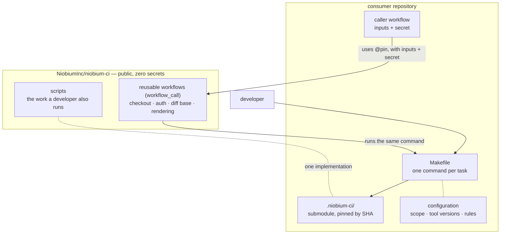
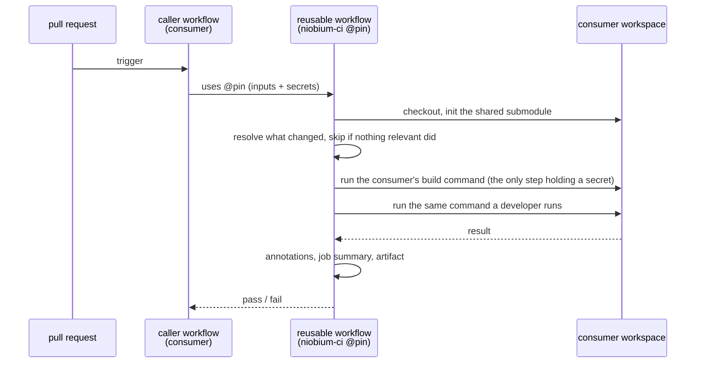

# niobium-ci

Shared CI for Niobium repositories, so consumers do not duplicate CI logic.

## How it works

Two kinds of thing live here, consumed two different ways.

**Reusable workflows** are referenced remotely with `uses:` at a pinned ref. They own
what a local run has no equivalent for: checkout and authentication, a pull request's
diff base, skipping expensive work when nothing relevant changed, and rendering
results into GitHub. They are the only place a consumer's secret is touched, and they
reference nothing in this repository by tag — so a consumer pinning by SHA gets a pin
that cannot move.

**Scripts** are checked out by the consumer as a **submodule**, pinned by commit SHA.
Work that a developer also runs on their own machine belongs here rather than inside a
workflow: a check that exists only in CI cannot be reproduced locally, and two copies
that merely ought to match eventually will not. Both sides execute the same file at
the same pinned commit.

Configuration is not shared. What a repository checks, which tool versions it expects
and which rules it enforces stay in that repository. What is shared is the runner, not
the policy.

A run flows from the caller through the reusable workflow, which prepares the
workspace and then delegates the work to the consumer's own command:

## Capabilities

Each capability documents its own setup — the submodule, the commands a consumer wires
up, and the caller workflows.

- **clang-tidy** — diff-only gate and whole-repository survey.
  See [`clang-tidy/README.md`](clang-tidy/README.md).

## Security

Secrets never live in this repository. Consumers pass them at call time to a reusable
workflow, which exposes them to the single step that needs them; the shared scripts are
secret-free and read no token. Pin every reference — a commit SHA or an immutable tag,
never a moving branch — so a change here cannot alter a consumer's CI until the pin is
deliberately bumped. See `SECURITY.md`.

## License

Apache 2.0.
