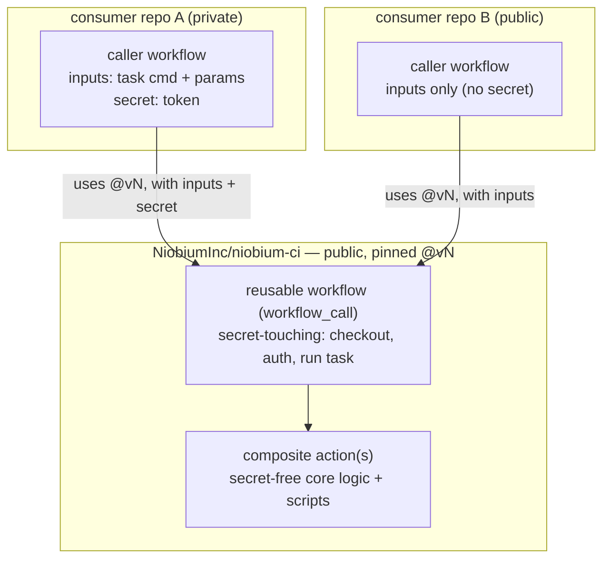
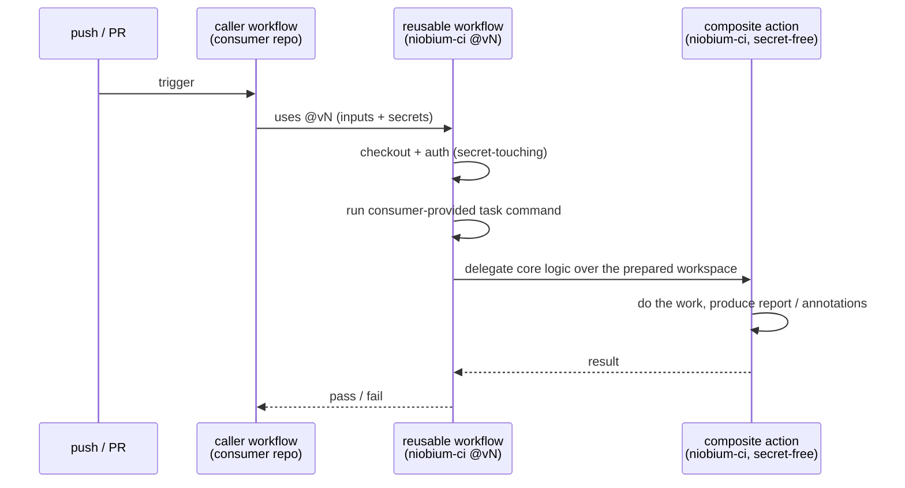

# niobium-ci

Reusable CI workflows and composite actions shared across Niobium repositories,
so consumers avoid duplicating CI logic.

## How it works

Each capability is a reusable workflow (a secret-touching wrapper that checks out,
authenticates, and runs the consumer-provided task command) plus a secret-free
composite action (the core logic). A consumer invokes it with a small caller
workflow that supplies inputs and, when needed, a secret. Secrets stay in the
consumer repository and are passed at call time — never stored here. The caller
pins the reference to a commit SHA or an immutable tag — never a moving branch —
so a change here cannot alter its CI until the pin is deliberately bumped.

A single run flows from the caller through the reusable workflow to the composite
action:

## Capabilities

Each capability is documented here as its workflow is added. _None yet._

## Security

Secrets never live in this repository; consumers pass them at call time. See
`SECURITY.md`.

## License

Apache 2.0.
